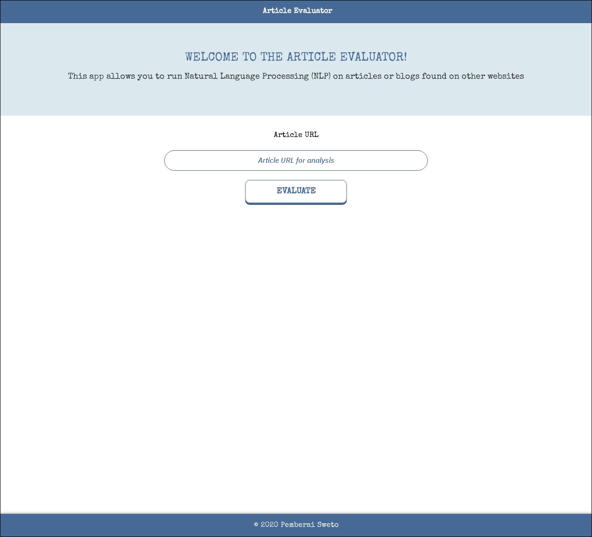

# Article Evaluator with Natural Language Processing

> This project showcases a web tool that allows users to run Natural Language Processing (NLP) on articles or blogs found on other websites using pure HTML, CSS, Javascript, Express and Webpack.


## Article Evaluator App



Visit the website [here](https://article-evaluator.herokuapp.com/)

## Installation

### Setup

Clone the source locally:

```sh
$ git clone https://github.com/thepembeweb/article-evaluator.git
$ cd article-evaluator
```
If you're on Debian or Ubuntu, you'll also need to install
`nodejs-legacy`:

Use your package manager to install `npm`.

```sh
$ sudo apt-get install npm nodejs-legacy
```

Install project dependencies:

```sh
$ npm install
```

Create a new .env file and add the following environment variables for the [Aylien API](https://docs.aylien.com/textapi/endpoints/#api-endpoints):

```sh
API_ID=**************************
API_KEY=**************************
```

Start the server app:

```sh
$ npm start
```

Open another terminal and start the client app:

```sh
$ npm run dev
```

Alternatively you can view the live website [here](https://article-evaluator.herokuapp.com/).

## Built With

* [HTML](https://en.wikipedia.org/wiki/HTML) - The markup language used
* [CSS](https://en.wikipedia.org/wiki/Cascading_Style_Sheets) - The style sheet language used
* [Javascript](https://en.wikipedia.org/wiki/JavaScript) - The programming language used
* [Node.js®](https://nodejs.org/) - The JavaScript runtime used
* [Express.js®](https://nodejs.org/) - The web application framework used
* [Webpack](https://webpack.js.org/) - The build tool used
* [Aylien API](https://docs.aylien.com/textapi/endpoints/#api-endpoints) - The Natural Language Processing API used

## Authors

* **[Pemberai Sweto](https://github.com/thepembeweb)** - *Initial work* - [Article Evaluator Project](https://github.com/thepembeweb/article-evaluator)

## License

[](http://badges.mit-license.org)

- This project is licensed under the MIT License - see the [LICENSE.md](LICENSE.md) file for details
- Copyright 2020 © [Pemberai Sweto](https://github.com/thepembeweb).


